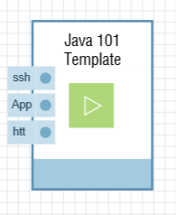
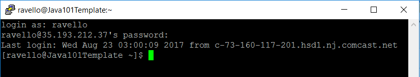
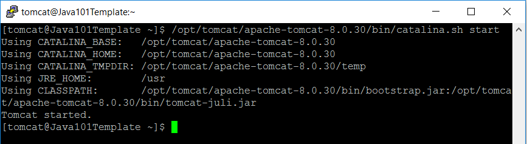
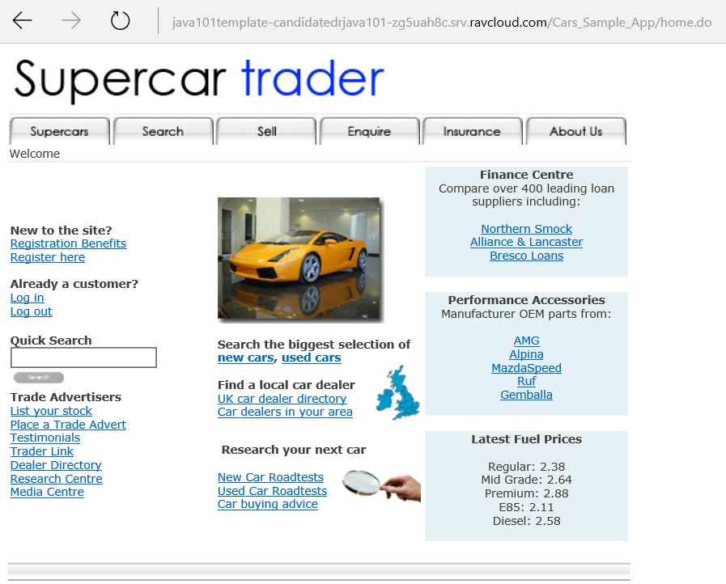
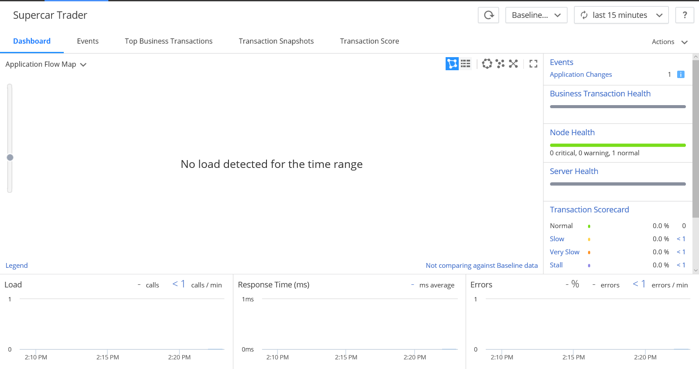
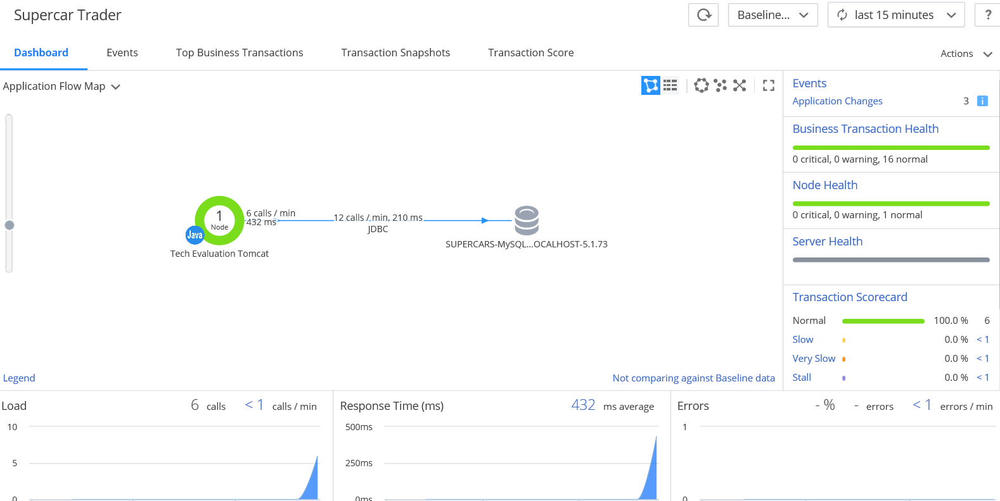
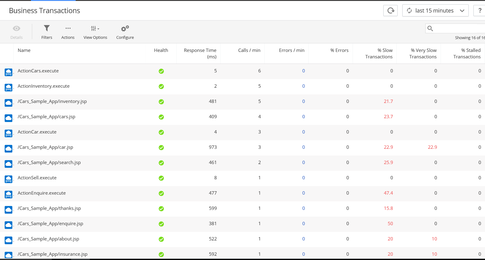

## AppDynamics Java 101 Lab V1.3 - Solution Engineer Hiring Exercise
The documented steps below are designed to provide an introduction to the AppDynamics solution to a potential pre-sales solution engineer candidate. By executing on the below items an engineer can gain a basic understanding of the AppDynamics products can collect metrics from multiple data sources, correlate the metrics into groupings for applications and alert based on thresholds for metrics.  

Installation of the controller, agents on multiple platforms, configuring of collectors for multiple products, and configuring items within the AppDynamics web based console are all documented in the items listed in the table of contents below.

## Table of Contents
- [Exercise 1: Controller and Agent Installation](#Exercise-1:-Controller-and-Agent-Installation)
- [Exercise 2: Business Transaction Configuration](#Exercise-2:-Business-Transaction-Configuration)
- [Exercise 3: Diagnostic Sessions](#Exercise-3:-Diagnostic-Sessions)
- [Exercise 4: SQL Parameter Capture](#Exercise-4:-SQL-Parameter-Capture)
- [Exercise 5: Custom Error Detection - Optional](#Exercise-5:-Custom-Error-Detection)
- [Exercise 6: Information Points - Optional](#Exercise-6:-Information-Points)
- [Exercise 7: JMX Capture - Optional](#Exercise-7:-JMX-Capture)
- [Exercise 8: Install EUM - Optional](#Exercise-8:-Install-EUM)
- [Exercise 9: Machine Agent - Optional](#Exercise-9:-Machine-Agent)
- [Exercise 10: Database Agent - Optional](#Exercise-10:-Database-Agent)

### Exercise 1: Controller and Agent Installation 
To install the controller and agent for AppDynamics into the server instance provided in Ravello, the following steps with be required.

#### Pre-Requisites
-  If you are running Windows - You have access to standard Linux system administrator tools - putty, winscp, mobixterm etc.
-  Your representative from AppDynamics should have provided the details for setting up your account on Ravello
-  This account needs to be setup with the correct identity domain (also provided by the representative)
-  The application instance assigned to you must be started as per the instructions - a running instance will look like below:



- You are able to ssh to the public IP on TCP/22 to the running instance with the ravello user account and with the password provided by your representatives



#### Exercise Completion and Answers
Follow the steps below to complete the controller and agent installation.

##### Downloading/Uploading the agent binaries:

- Sign up for a AppDynamics account at [https://portal.appdynamics.com/account/signup/signupForm/](https://portal.appdynamics.com/account/signup/signupForm/)
	- Pick the SaaS option
	- Wait for your user account to become active, should take about 20 seconds
	- Using the e-mail you received - log into the AppDynamics web console using the SaaS URL provided
	- Under Home, click 
	- Start the Getting Started Wizard, click 
	- Under Applications, click 
	- Leave all the default options and click 
	- Once the zip is downloaded - upload to your target Ravello server using SCP and the ravello user

##### Putting the agent in the right location on the Ravello target

- From the ravello user bash prompt change to root `su -`
- Move the file to tomcat home directory `mv /home/ravello/AppServerAgent-4.3.3.4.zip /home/tomcat`
- Change ownership of the zip file `chown tomcat:tomcat /home/appd/AppServerAgent-4.3.3.4.zip`
- Change to the tomcat user `su - tomcat`
- Extract the AppServerAgent zip `unzip /home/tomcat/AppServerAgent-4.3.3.4.zip -d /home/tomcat/appagent`

##### Enabling the agent libraries for use with Tomcat

- From the ravello user bash prompt change to root `su -`
- Change to the tomcat user `su - tomcat`
- Modify a setenv.sh environment variables file `vi /opt/tomcat/apache-tomcat-8.0.30/bin/setenv.sh`
- Add the following line to setenv.sh 
```bash 
export CATALINA_OPTS="$CATALINA_OPTS -javaagent:/home/tomcat/appagent/javaagent.jar"
```
- Add execute permissions to the script `chmod 755 /opt/tomcat/apache-tomcat-8.0.30/bin/setenv.sh`
- Modify the controller info xml to update application, business service and host information with similar values below - file is found in `/home/tomcat/appagent/conf/controller-info.xml`

```xml
    <application-name>Supercar Trader</application-name>

    <tier-name>Tech Evaluation Tomcat</tier-name>

    <node-name>Candidate_DR_Java101Lab</node-name>
```

##### Starting Tomcat and Verifying the AppDynamics Components are Running

- From the tomcat user shell run `/opt/tomcat/apache-tomcat-8.0.30/bin/catalina.sh start`



- Verify that applications are running by navigating to the URL for the Cars_Sample_App



- The application managed by the agent should now be visible in the AppDynamics console



##### Generating Some Application Load

- When Tomcat, the AppDynaics libraries and the SuperCar Trader is app are running in Tomcat - follow the steps to simulate a some load against it and observe in the AppDynamics console
- Login to the Ravello machine via SSH and the ravello user
- Execute the generate-load script `/home/ravello/generate-load.sh`
- Once the load script is running, the SuperCar Trader app's load should look similar to below.


#### Exercise 1 Questions and Answers
1. What nodes do you see, what nodes are discovered?
n
In the dashboard view, there are 2 distinct nodes. One node is the one which was setup to monitor the instance of Tomcat obviously appears.  The second one (a database instance) is automatically discovered by examining the configuration for Tomcat and determining the JDBC connection information found for the instance of Tomcat.
2. What Business Transactions do you have?

By clicking the Business Transactions tab for a particular application, you are able to view metrics and determine patters on running and past transactions.  In the case of this application there are 16 or so appear on the dashboad A screenshot of some of the sample ones are below.



3. Do you have any errors?

No, based on the charts found on the business conext and service endpoint dashboards - no error messages were encountered. 

### Exercise 2: Business Transaction Configuration 
### Exercise 3: Diagnostic Sessions 
### Exercise 4: SQL Parameter Capture 
### Exercise 5: Custom Error Detection 
### Exercise 6: Information Points 
### Exercise 7: JMX Capture
### Exercise 8: Install EUM 
### Exercise 9: Machine Agent 
### Exercise 10: Database Agent

